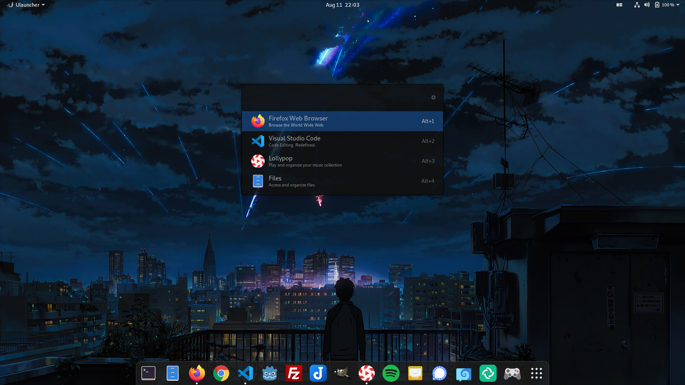

# transparent-adwaita

Transparent dark theme for uLauncher using Adwaita's blue as an accent color.

## Installation

 - `mkdir -p ~/.config/ulauncher/user-themes`
 - `cd ~/.config/ulauncher/user-themes`
 - `git clone git@github.com:kalenpw/transparent-adwaita.git`
 - Open ulauncher settings and select Transparent Adwaita

## Screenshot

